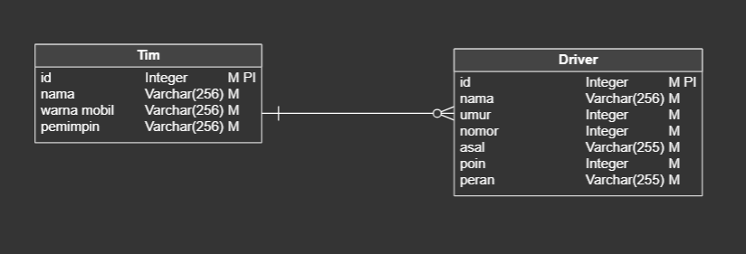

# F1 Dashboard

This repo was created for an internship position. This repo is about an implementation of CRUD API using laravel

## Database Design 

The following image illustrates the relation between the two entities used in this repository

# Dependency
- php 8.1
- composer 2.8.1
- mySQL

# Suggestions
For any developer planning to continue working on my app, make sure to set a limit on the number of attempts, as it can become quite annoying without it.

## Screenshots

